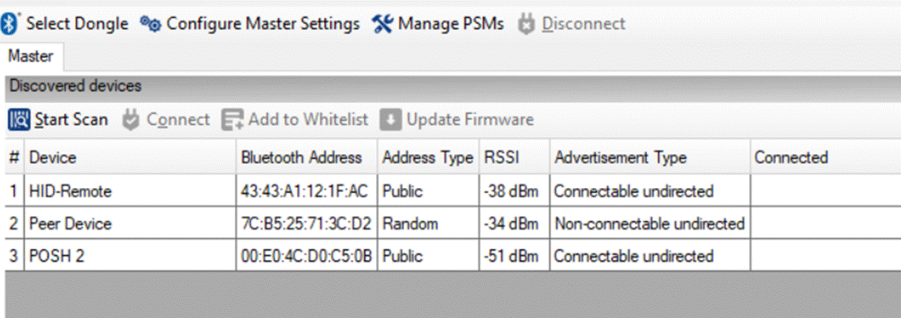
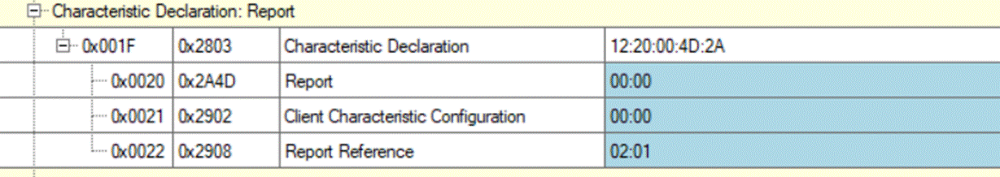
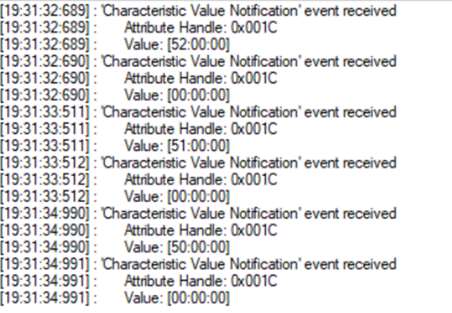
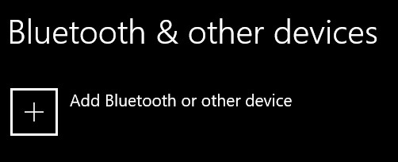

# AIROC&trade; CYW20829 Voice Remote Reference Solution

This Solution demo demonstrates the implementation of a AIROC™ CYW20829 Voice Remote Reference Solution using the Infineon AIROC™ CYW20829 Bluetooth® LE MCU and ModusToolbox™ Software Environment.

[View this README on GitHub.](https://github.com/Infineon/mtb-example-btstack-freertos-cyw20829-voice-remote)

[Provide feedback on this code example.](https://cypress.co1.qualtrics.com/jfe/form/SV_1NTns53sK2yiljn?Q_EED=eyJVbmlxdWUgRG9jIElkIjoiQ0UyMzUxNTEiLCJTcGVjIE51bWJlciI6IjAwMi0zNTE1MSIsIkRvYyBUaXRsZSI6IkFJUk9DJnRyYWRlOyBDWVcyMDgyOSBWb2ljZSBSZW1vdGUgUmVmZXJlbmNlIFNvbHV0aW9uIiwicmlkIjoicmFubSIsIkRvYyB2ZXJzaW9uIjoiMS4wLjAiLCJEb2MgTGFuZ3VhZ2UiOiJFbmdsaXNoIiwiRG9jIERpdmlzaW9uIjoiTUNEIiwiRG9jIEJVIjoiSUNXIiwiRG9jIEZhbWlseSI6IkJUQUJMRSJ9)

## Requirements

- [ModusToolbox™ software](https://www.cypress.com/products/modustoolbox-software-environment) v2.4
- Programming Language: C
- BSP: CYW920829-VR
- Associated Parts: [AIROC&trade; CYW20829 Bluetooth&reg; LE SoC](https://www.infineon.com/cms/en/product/promopages/airoc20829)
- CY8CKIT-005 MiniProg 4

## Supported Kits

- CYW20829 Reference Voice Remote Kit

## Hardware Setup
This example uses the kit’s default configuration. See the CYW920829-VR Voice Remote kit user guide to ensure that the kit is configured correctly.

## Software Setup
Install a terminal emulator if you don't have one. Instructions in this document use [Tera Term](https://ttssh2.osdn.jp/index.html.en).

## Using the Code Example

### In Eclipse IDE for ModusToolbox:

1. Click the **New Application** link in the Quick Panel (or, use **File** > **New** > **ModusToolbox Application**).

2. Pick a kit supported by the solution demo from the list shown in the **Project Creator - Choose Board Support Package (BSP)** dialog.

   When you select a supported kit, the example is reconfigured automatically to work with the kit. To work with a different supported kit later, use the **Library Manager** to choose the BSP for the supported kit. You can use the Library Manager to select or update the BSP and firmware libraries used in this application.

   To access the Library Manager, right-click the application name from the Project Workspace window in the IDE, and select **ModusToolbox** > **Library Manager** (or select it from the **Quick Panel**).

   You can also just start the application creation process again and select a different kit.

   If you want to use the application for a kit not listed here, you may need to update the source files. If the kit does not have the required resources, the application may not work.

3. In the **Project Creator - Select Application** dialog, choose the example.

4. Optionally, update the **Application Name** and **Location** fields with the application name and local path where the application is created.

5. Click **Create** to complete the application creation process.

For more details, see the Eclipse IDE for ModusToolbox User Guide: *{ModusToolbox install directory}/ide_{version}/docs/mt_ide_user_guide.pdf*.

### In Command-line Interface (CLI):

1. Download and unzip this repository onto your local machine, or clone the repository.

2. Open a CLI terminal and navigate to the application folder.

   On Linux and macOS, you can use any terminal application. On Windows, navigate to the modus-shell directory (*{ModusToolbox install directory}/tools_\<version>/modus-shell*) and run *Cygwin.bat*.

3. Import the required libraries by executing the `make getlibs` command.

### In Third-party IDEs:

1. Follow the instructions from the [CLI](#in-command-line-interface-cli) section to download or clone the repository, and import the libraries using the `make getlibs` command.

2. Export the application to a supported IDE using the `make <ide>` command.

3. Follow the instructions displayed in the terminal to create or import the application as an IDE project.

For more details, see the "Exporting to IDEs" section of the ModusToolbox User Guide: *{ModusToolbox install directory}/ide_{version}/docs/mtb_user_guide.pdf*.


## Building and Programming the board
1. Connect the board to your PC using the provided USB cable through the MiniProg4 USB connector.

2. Use your favorite serial terminal application and connect the USB-UART cable to the UART connector on the remote board. Configure the terminal application to access the serial(COM) port using the following settings.

   Baud rate: 115200 bps; Data: 8 bits; Parity: None; Stop: 1 bit; Flow control: None; New line for receive data: Line Feed(LF) or Auto setting

3. Program the board.

   - **Using Eclipse IDE for ModusToolbox**:
	1. Select the application project in the Project Explorer.
	2. In the **Quick Panel**, scroll down, and click **\<Application Name> Program (KitProg3_MiniProg4)**.

   - **Using CLI**:

   ​	From the terminal, execute the `make program` command to build and program the application using the default toolchain to the default target. You can specify a target and toolchain manually:

   ```
   make program TARGET=<BSP> TOOLCHAIN=<toolchain>
   ```

   ​	Example:

   ```
   make program TARGET=CYW920829-VR TOOLCHAIN=GCC_ARM
   ```

     **Note**:  Before building the application, ensure that the *deps* folder contains the BSP file (*TARGET_xxx.lib*) corresponding to the TARGET. Execute the `make getlibs` command to fetch the BSP contents before building the application.

   After programming, the application starts automatically. Observe the messages on the UART terminal, and wait for the device to make all the required connections.

## Debugging

You can debug the example to step through the code. In the IDE, use the **\<Application Name> Debug (KitProg3_MiniProg4)** configuration in the **Quick Panel**. For more details, see the "Program and Debug" section in the Eclipse IDE for ModusToolbox User Guide: *{ModusToolbox install directory}/ide_{version}/docs/mt_ide_user_guide.pdf*.

## Firmware Design and Implementation
### Steps to use the voice remote application

1. Build Your application for either **Andriod TV** or **OPUS**
Changing ```ENABLE_CODEC``` in Makefile
```make
ENABLE_CODEC = $(ATV_ADPCM)
```
or
```make
ENABLE_CODEC = $(OPUS_CODEC)
```
2. This Application has the support for both Digital Mic and Analog Mic. The Remote Hardware
comes with  Analog Mic mounted on the PCB.
Change ```ENABLE_MIC``` in makefile to select the mic configuration.
```Make
ENABLE_MIC = $(ANALOG_MIC)
ENABLE_MIC = $(PDM_MIC)
```
3. To Remove the Pairing Info, press the **"Home Key"** for **10 seconds on the remote** control to remove the pairing information.
When the remote control is paired to TV, please **"unpair/forget"** on the TV first and then press **"Home Key"** for 10 seconds to delete pairing.

4. Please note that **OPUS** encoding for audio can be tested only if the host supports the OPUS decoding.

5. When Battery Capacity is **less then 5%**, the device will go to hibernate mode;
And to come out of this **hibernate** state, Power Cycle the Remote by removing the battery and inserting it again.

The following points are some of the design and implementation specific details that a user might need to know to understand the behavior.

1. The Voice Remote starts advertising as **"HID-Remote"** at High duty for **60 seconds** and then followed by low duty for **30 seconds** and then the advertisements are turned off.

2. When the advertisements are off, **pressing any key** on the remote control will start advertisements to get it discovered by peer devices.


## Test Procedure

The Complexity in testing the voice remote will depend on the Host. CySmart Desktop application is simpler for testing non-audio functionality. But it cannot be used for testing Audio.

### General Test Instructions

The Remote application uses flash to store pairing/bonding information. In order to clear the previously bonded devices and to flash a new firmware to the board, use the following command from CLI.
   ```
   make erase
   make program
   ```

### Testing on CySmart Desktop Application

Download the [CySmart 1.3](https://www.cypress.com/file/415596/download) as Windows PC host to test the application for non-voice functionality.

1. Click on "Start Scan" in CySmart to discover the nearby devices. Connect to the device listed as “HID-Remote” in the CySmart application. Select the device and click on 'Connect'. Alternately, double click the device to connect.

   

2. After Connecting successfully, Click on “Pair”.

   1. On receiving “Pairing Successful” pop up window, click on “Discover all attributes”.
   2. Now the Attributes and attribute handles will be populated. And Now click on “Read all characteristics” and “Read all descriptors”.

   

3. Once all the characteristics and descriptors are populated, click on “Enable Notifications”. After Enabling notifications, the client characteristic Configuration Descriptor will have “01:00”. On every button press, you should be able to see the keycodes in the CySmart logs as below.

   

4. Here are the list of keycodes and hidcodes for the Android TV/ADPCM and Opus.
The below table is for Android TV / ADPCM

| S.No | Row | Column | KEY_CODE | HID_CODE | Functionality             |
| ---- |---- | -----  | -------- | -------  |  ------------------------ |
| 1    | 0   | 2      | 6        | 0x89     |  MULTIFUNCTION            |
| 2    | 2   | 2      | 8        | 0x30     |  POWER                    |
| 3    | 0   | 5      | 15       | 0xE2     |  MUTE                     |
| 4    | 1   | 5      | 16       | 0x42     |  DPAD_UP                  |
| 5    | 2   | 5      | 17       | 0x183    |  SETTINGS/SETUP           |
| 6    | 0   | 6      | 18       | 0x45     |  DPAD_RIGHT               |
| 7    | 1   | 6      | 19       | 0x41     |  DPAD_SELECT / OK         |
| 8    | 2   | 6      | 20       | 0x44     |  DPAD_LEFT                |
| 9    | 0   | 7      | 21       | 0x224    |  BACK                     |
| 10   | 1   | 7      | 22       | 0x43     |  DPAD_DOWN                |
| 11   | 2   | 7      | 23       | 0x40     |  MENU                     |
| 12   | 0   | 8      | 24       | 0xE9     |  VOLUME_UP                |
| 13   | 1   | 8      | 25       | 0x221    |  VOICE_ASSIST / MIC       |
| 14   | 2   | 8      | 26       | 0x42     |  PAGE_UP                  |
| 15   | 0   | 9      | 27       | 0xEA     |  VOLUME_DOWN              |
| 16   | 1   | 9      | 28       | 0x223    |  HOME                     |
| 17   | 2   | 9      | 29       | 0x43     |  PAGE_DOWN                |

The below table is for Opus.
| S.No | Row | Column | KEY_CODE | HID_CODE | Functionality             |
| ---- |---- | -----  | -------- | -------  |  ------------------------ |
| 1    | 0   | 2      | 6        | 0x89     |  MULTIFUNCTION            |
| 2    | 2   | 2      | 8        | 0x66     |  POWER                    |
| 3    | 0   | 5      | 15       | 0xE2     |  MUTE                     |
| 4    | 1   | 5      | 16       | 0x52     |  DPAD_UP                  |
| 5    | 2   | 5      | 17       | 0x183    |  SETTINGS/SETUP           |
| 6    | 0   | 6      | 18       | 0x4F     |  DPAD_RIGHT               |
| 7    | 1   | 6      | 19       | 0x58     |  DPAD_SELECT / OK         |
| 8    | 2   | 6      | 20       | 0x50     |  DPAD_LEFT                |
| 9    | 0   | 7      | 21       | 0xF1     |  BACK                     |
| 10   | 1   | 7      | 22       | 0x51     |  DPAD_DOWN                |
| 11   | 2   | 7      | 23       | 0x40     |  MENU                     |
| 12   | 0   | 8      | 24       | 0xE9     |  VOLUME_UP                |
| 13   | 1   | 8      | 25       | 0x221    |  VOICE_ASSIST / MIC       |
| 14   | 2   | 8      | 26       | 0x4B     |  PAGE_UP                  |
| 15   | 0   | 9      | 27       | 0xEA     |  VOLUME_DOWN              |
| 16   | 1   | 9      | 28       | 0x223    |  HOME                     |
| 17   | 2   | 9      | 29       | 0x4E     |  PAGE_DOWN                |

### Testing on Android TV

1. Turn on your Android TV and navigate to the "Settings" using the Remote that came with the TV.
2. In "Remotes & accessories" section under the "Settings", click on "Pair Remote or accessory".
3. Once you click on the "Pair Remote or accessory", the TV will start discovering Bluetooth devices around it.
4. Discover the "hid-remote" device and click on it. Make sure your device is advertising at this time.
5. Once paired and connected, make sure all the keys are working.
6. For the voice functionality, Use some common phrases that the Google TV can understand such as  "What's the weather at x location?".

### Known issues on Android TV

1. Setup and MultiFunction Key may not be supported by some of the TV Vendors. So, users can modify as per the TV support.

### Testing on Windows 10

1. Navigate to Windows 10 Settings and click on "Devices" as shown below.

2. Click on "Add Bluetooth or Other device". Make sure your device is advertising at this time.

3. "hid-remote" will be listed in the device discovery. Once you click on the device, Windows will initiate pairing and connection. The Windows will show a notification that "Windows is setting up a device". Windows will take few seconds to exchange link keys.
4. Once connected, you will get the following Notification on Windows.

5. Open a notepad with some text in it, to see the keypress changes in the application.
6. You can reset the device and the device will be automatically reconnected to check for reconnection.


## Resources and Settings
This section explains the ModusToolbox resources and their configuration as used in this code example. Note that all the configuration explained in this section has already been done in the code example. ModusToolbox stores the configuration settings of the application in the *design.modus* file. This file is used by the graphical configurators, which generate the configuration firmware. This firmware is stored in the application’s *GeneratedSource* folder.

- **Device Configurator:** Use this tool to enable/configure the peripherals and pins used in the application. See the
[Device Configurator Guide](https://www.cypress.com/ModusToolboxDeviceConfig).

- **Bluetooth Configurator:** Use this tool to generate/modify the Bluetooth LE GATT database. See the
[Bluetooth Configurator Guide](https://www.cypress.com/ModusToolboxBLEConfig).

## Document History

Document Title: CE235151 - AIROC LE CYW20829 Voice Remote

| Version | Description of Change |
| ------- | --------------------- |
| 1.0.0   | Beta Release of Voice Remote Application. This version is not meant for production. |

------


-------------------------------------------------------------------------------

© Cypress Semiconductor Corporation, 2020. This document is the property of Cypress Semiconductor Corporation and its subsidiaries (“Cypress”).  This document, including any software or firmware included or referenced in this document (“Software”), is owned by Cypress under the intellectual property laws and treaties of the United States and other countries worldwide.  Cypress reserves all rights under such laws and treaties and does not, except as specifically stated in this paragraph, grant any license under its patents, copyrights, trademarks, or other intellectual property rights.  If the Software is not accompanied by a license agreement and you do not otherwise have a written agreement with Cypress governing the use of the Software, then Cypress hereby grants you a personal, non-exclusive, nontransferable license (without the right to sublicense) (1) under its copyright rights in the Software (a) for Software provided in source code form, to modify and reproduce the Software solely for use with Cypress hardware products, only internally within your organization, and (b) to distribute the Software in binary code form externally to end users (either directly or indirectly through resellers and distributors), solely for use on Cypress hardware product units, and (2) under those claims of Cypress’s patents that are infringed by the Software (as provided by Cypress, unmodified) to make, use, distribute, and import the Software solely for use with Cypress hardware products.  Any other use, reproduction, modification, translation, or compilation of the Software is prohibited.
TO THE EXTENT PERMITTED BY APPLICABLE LAW, CYPRESS MAKES NO WARRANTY OF ANY KIND, EXPRESS OR IMPLIED, WITH REGARD TO THIS DOCUMENT OR ANY SOFTWARE OR ACCOMPANYING HARDWARE, INCLUDING, BUT NOT LIMITED TO, THE IMPLIED WARRANTIES OF MERCHANTABILITY AND FITNESS FOR A PARTICULAR PURPOSE.  No computing device can be absolutely secure.  Therefore, despite security measures implemented in Cypress hardware or software products, Cypress shall have no liability arising out of any security breach, such as unauthorized access to or use of a Cypress product.  CYPRESS DOES NOT REPRESENT, WARRANT, OR GUARANTEE THAT CYPRESS PRODUCTS, OR SYSTEMS CREATED USING CYPRESS PRODUCTS, WILL BE FREE FROM CORRUPTION, ATTACK, VIRUSES, INTERFERENCE, HACKING, DATA LOSS OR THEFT, OR OTHER SECURITY INTRUSION (collectively, “Security Breach”).  Cypress disclaims any liability relating to any Security Breach, and you shall and hereby do release Cypress from any claim, damage, or other liability arising from any Security Breach.  In addition, the products described in these materials may contain design defects or errors known as errata which may cause the product to deviate from published specifications.  To the extent permitted by applicable law, Cypress reserves the right to make changes to this document without further notice. Cypress does not assume any liability arising out of the application or use of any product or circuit described in this document.  Any information provided in this document, including any sample design information or programming code, is provided only for reference purposes.  It is the responsibility of the user of this document to properly design, program, and test the functionality and safety of any application made of this information and any resulting product.  “High-Risk Device” means any device or system whose failure could cause personal injury, death, or property damage.  Examples of High-Risk Devices are weapons, nuclear installations, surgical implants, and other medical devices.  “Critical Component” means any component of a High-Risk Device whose failure to perform can be reasonably expected to cause, directly or indirectly, the failure of the High-Risk Device, or to affect its safety or effectiveness.  Cypress is not liable, in whole or in part, and you shall and hereby do release Cypress from any claim, damage, or other liability arising from any use of a Cypress product as a Critical Component in a High-Risk Device.  You shall indemnify and hold Cypress, its directors, officers, employees, agents, affiliates, distributors, and assigns harmless from and against all claims, costs, damages, and expenses, arising out of any claim, including claims for product liability, personal injury or death, or property damage arising from any use of a Cypress product as a Critical Component in a High-Risk Device.  Cypress products are not intended or authorized for use as a Critical Component in any High-Risk Device except to the limited extent that (i) Cypress’s published data sheet for the product explicitly states Cypress has qualified the product for use in a specific High-Risk Device, or (ii) Cypress has given you advance written authorization to use the product as a Critical Component in the specific High-Risk Device and you have signed a separate indemnification agreement.
Cypress, the Cypress logo, Spansion, the Spansion logo, and combinations thereof, WICED, PSoC, CapSense, EZ-USB, F-RAM, and Traveo are trademarks or registered trademarks of Cypress in the United States and other countries.  For a more complete list of Cypress trademarks, visit cypress.com.  Other names and brands may be claimed as property of their respective owners.